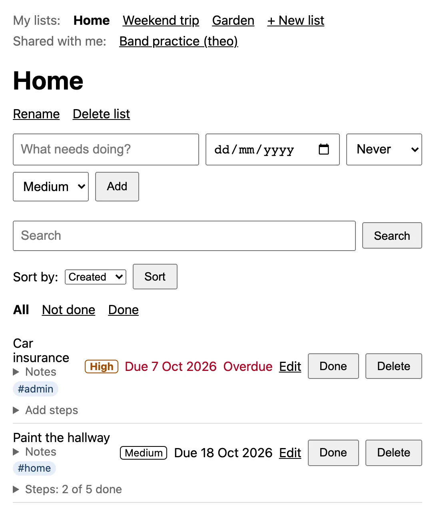
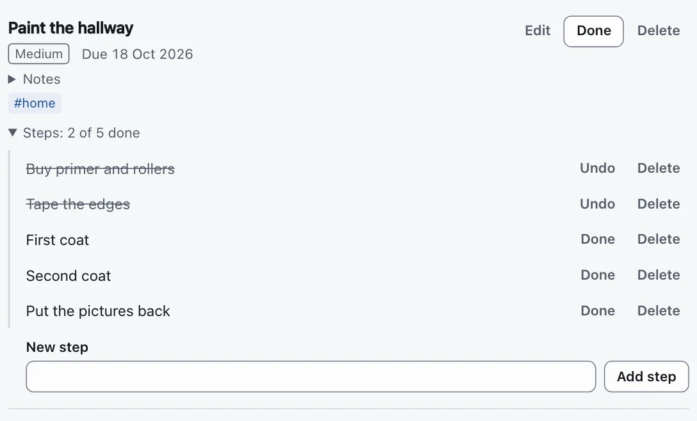
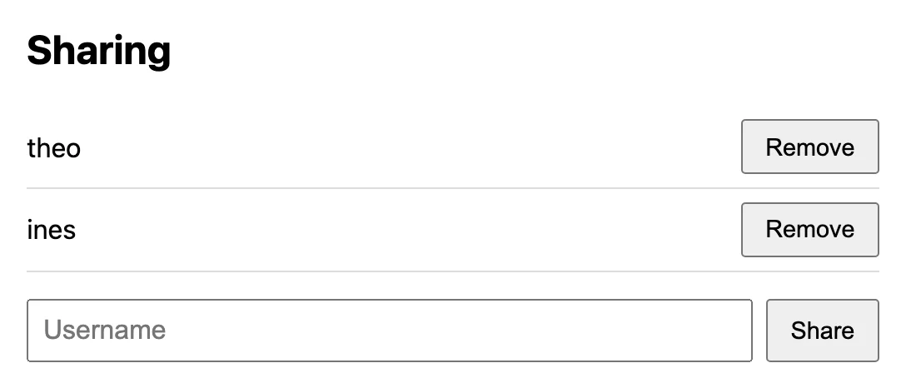
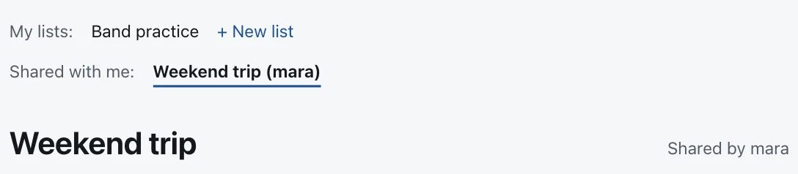
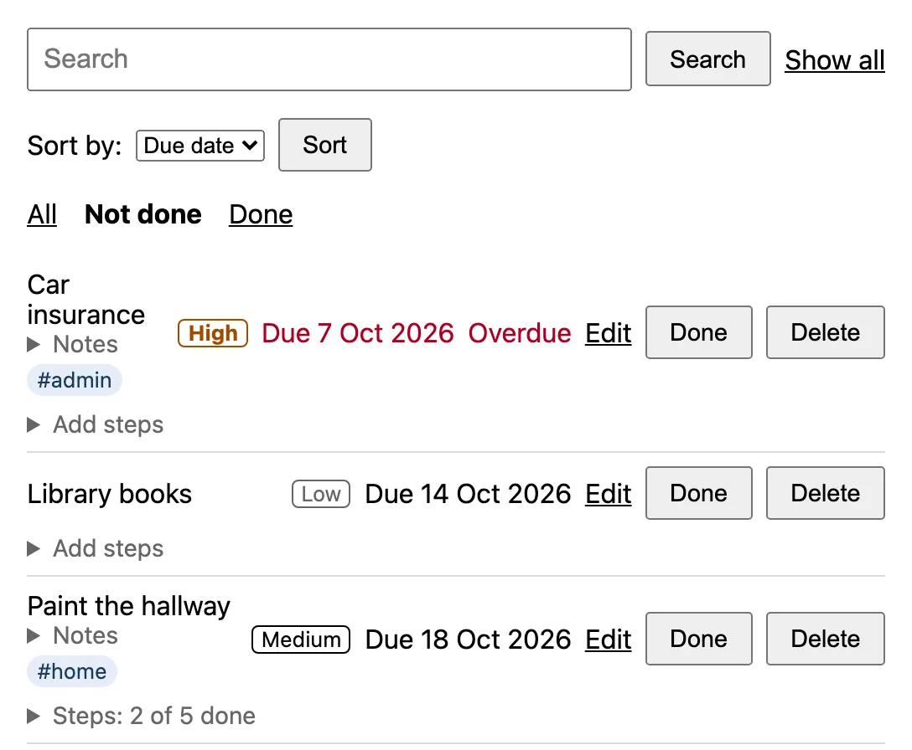
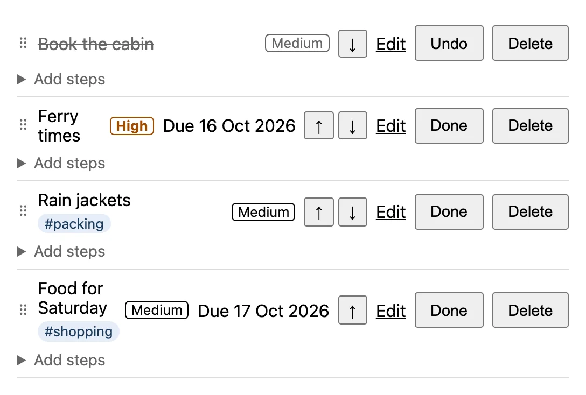
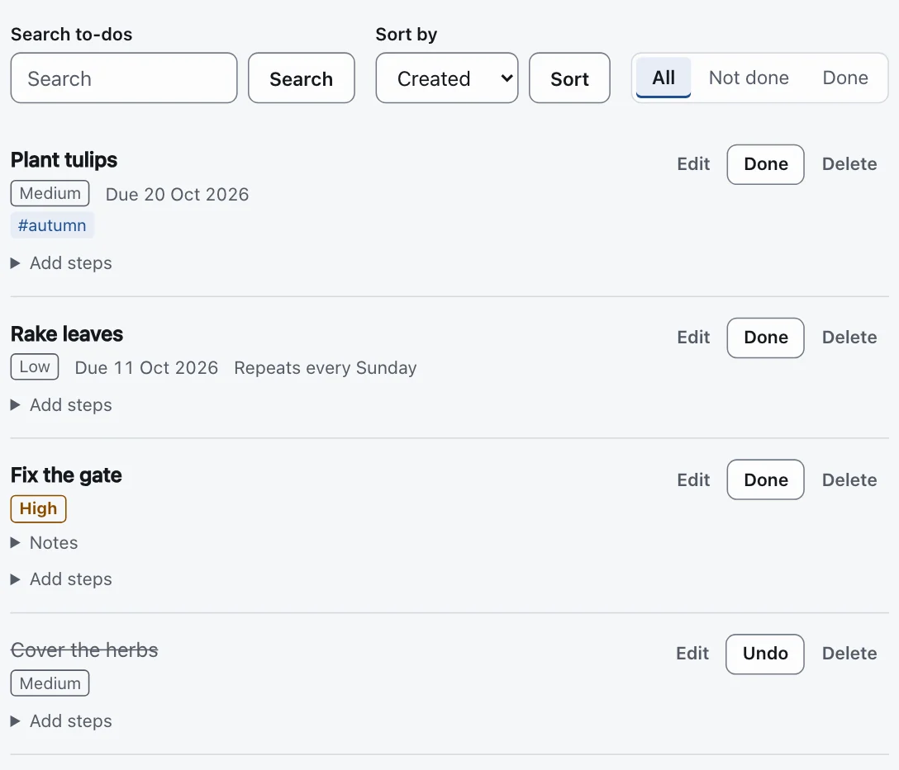
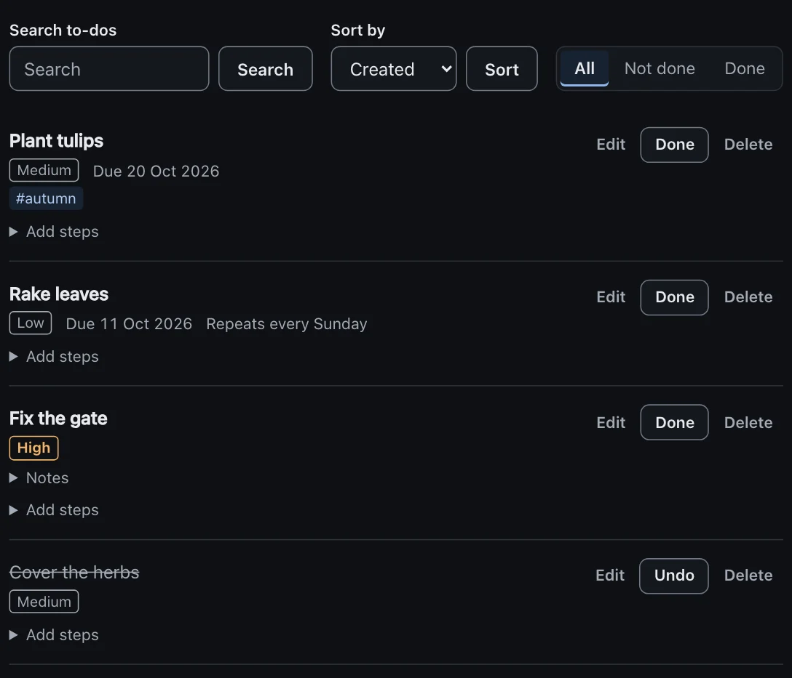

# To-do list

A small to-do list app, built with Django. Make a few lists, add to-dos with a due date, a priority
and tags, break a big to-do into steps, and share a list with the people you plan with. It runs on
your own computer, and your data stays in one file, `db.sqlite3`.

The pictures below are real screenshots of the app, with invented sample data. They follow your
light or dark GitHub theme. To take them again after the app changes, run `make landing-shots`.

**Contents:** [What it does](#what-it-does) · [Run it on your laptop](#run-it-on-your-laptop) ·
[Reminders on your Mac](#reminders-on-your-mac) · [Tests](#tests) · [Checks](#checks) ·
[How it is put together](#how-it-is-put-together) · [Put it on the internet](#put-it-on-the-internet)

## What it does

### Your lists and to-dos

<picture>
  <source media="(prefers-color-scheme: dark)" srcset="todos/static/todos/landing/list-dark.webp">
  
</picture>

- Keep your to-dos in **several lists**, like "Home" and "Work". When you sign up, your first
  list, "Inbox", is already there. You can make, rename and delete lists.
- Give a to-do a **due date**. When the day has passed, it says **Overdue** in red.
- Give it a **priority** (Low, Medium or High), **tags** (like `#home`) and **notes**.
- A to-do can **repeat** every day, week or month: mark it **Done**, and the next one appears
  with its new date.
- **Edit**, **Done** (and **Undo**) and **Delete** sit on every row. **Clear completed** deletes
  all the done to-dos of a list at once, after asking once more.

### Steps inside a to-do

<picture>
  <source media="(prefers-color-scheme: dark)" srcset="todos/static/todos/landing/steps-dark.webp">
  
</picture>

Break a big to-do into small steps and tick them off one by one. The row shows how far you are,
like "Steps: 2 of 5 done".

### Share a list

<picture>
  <source media="(prefers-color-scheme: dark)" srcset="todos/static/todos/landing/share-owner-dark.webp">
  
</picture>

The owner of a list shares it by typing another person's username. Those people are its
**members**: they can add, edit, finish and delete its to-dos. Only the owner can rename, delete
or share the list, and remove a member. Members do not see each other.

<picture>
  <source media="(prefers-color-scheme: dark)" srcset="todos/static/todos/landing/share-member-dark.webp">
  
</picture>

A member finds the list under **Shared with me**, and can leave it at any time.

### Find a to-do, and sort them

<picture>
  <source media="(prefers-color-scheme: dark)" srcset="todos/static/todos/landing/find-dark.webp">
  
</picture>

- **Search** the titles, notes and tags of a list.
- **Filter**: show All, Not done or Done.
- **Sort by** date added, due date, priority, title, or your own order.

### Put them in your own order

<picture>
  <source media="(prefers-color-scheme: dark)" srcset="todos/static/todos/landing/order-dark.webp">
  
</picture>

With **Sort by: Manual**, drag a to-do by its handle, or use the arrow buttons (they also work
with a keyboard). The order belongs to the list, so everyone who shares it sees the same order.

### Light or dark, like your system

<p>
  
  
</p>

The app follows the light or dark setting of your computer or phone. It works on a phone too.

### Private by default

Every page needs a login. A person sees only their own lists and the lists shared with them;
someone else's list gives "not found", as if it did not exist. A visitor who is not logged in only
sees a front page that explains the app, with **Create an account** and **Log in**.

Optional: your Mac can show you **one notification each morning** with the to-dos due that day.
It is off until you set it up; see [Reminders on your Mac](#reminders-on-your-mac).

## Run it on your laptop

**The short version, on a Mac:** install uv (step 1), get the code (step 2), then run
`make setup` and `make run`, and open <http://127.0.0.1:8000/>. The steps below explain each part.

**1. Install uv, once.** uv installs Python and this project's packages for you.

Mac:

```bash
curl -LsSf https://astral.sh/uv/install.sh | sh
```

Windows (PowerShell):

```powershell
powershell -ExecutionPolicy ByPass -c "irm https://astral.sh/uv/install.ps1 | iex"
```

Close the terminal and open a new one, then check with `uv --version`.

**2. Get the code.**

```bash
git clone https://github.com/Compiledex/anyone-can-build-todo.git
cd anyone-can-build-todo
```

**3. Install the packages.** The first time, uv also downloads the right version of Python.

```bash
uv sync
```

**4. Create the database.** This makes a file called `db.sqlite3`.

```bash
uv run python manage.py migrate
```

If your `db.sqlite3` already has to-dos from before accounts existed, `migrate` gives them to the
oldest admin account. Make one first with `uv run python manage.py createsuperuser`, then run
`uv run python manage.py migrate` again.

**5. Download the test browser.** Some tests use a real Chromium browser. This downloads it, about
150 MB, once.

```bash
uv run playwright install chromium
```

**6. Turn on the commit checks.** From now on, every `git commit` checks your code first.

```bash
uv run pre-commit install
```

**7. Start the server.**

```bash
uv run python manage.py runserver
```

Open <http://127.0.0.1:8000/>. You see the landing page, which says what the app does. Click
*Create an account*. Each account sees only its own
lists and to-dos, plus the lists other people share with it. Press `Ctrl+C` in the terminal to
stop the server.

**8. Run the tests.**

```bash
uv run python manage.py test
```

You should see `OK`, and then one line for each layer of tests:

```
Test layers
  CUJ          24 passed
  Integration  406 passed
  Unit         107 passed
```

On a Mac, `make` does the same in fewer words: `make setup` is steps 3 to 6, `make run` is step 7,
`make test` is step 8. `make help` lists the rest.

## Reminders on your Mac

Once a day, at 08:00, your Mac can show **one notification** with the to-dos in **your own lists**
that are **due today** and not done (not the lists others shared with you). If nothing is due,
there is no notification. A to-do is shown only once a day.

You can run it by hand at any time (replace `alice` with your username on the site):

```bash
uv run python manage.py send_reminders --user alice
```

It prints `Showed 1 notification (2 to-dos) for alice.` or `No to-dos due today for alice.`

To run it every morning, the Mac's own scheduler, **launchd**, starts it. You set this up once, in
the Terminal. These steps change your Mac's settings, so you do them yourself (not the AI).

1. **Move the project out of `Documents` (recommended).** macOS protects `Documents` from programs
   that start in the background, so launchd cannot go into the project folder, and the job fails
   with an empty log. Move it, for example to `~/code/anyone-can-build-todo`, and run `make setup`
   again there. Do not give Python "Full Disk Access" instead: that gives every Python script on
   the Mac access to all your files. (iCloud "Desktop & Documents" can also touch `db.sqlite3`
   while the app writes to it.)
2. **Get the database ready**, after you pull this feature:

   ```bash
   uv run python manage.py migrate
   ```

3. **Allow notifications first.** Show one test notification:

   ```bash
   osascript -e 'display notification "Test" with title "To-do list"'
   ```

   Open **System Settings → Notifications → Script Editor** and turn on **Allow notifications**.
   Run the line again and check that you see "Test", and that a Focus mode (like Do Not Disturb)
   is off. Do this before step 4: `osascript` says "it worked" even when notifications are not
   allowed, and then the to-dos are marked as reminded although you saw nothing.
4. **Try the command by hand.** Make a to-do due today in one of your own lists, then run
   `uv run python manage.py send_reminders --user <your username>`. To try again the same day,
   make a **new** to-do due today: the shown ones are now marked.
5. **Fill in the template** `deploy/macos/com.anyone-can-build-todo.reminders.plist`. In the
   project folder (replace `alice` with your username):

   ```bash
   mkdir -p ~/Library/LaunchAgents
   sed -e "s|__REPO_PATH__|$(pwd)|g" -e "s|__HOME__|$HOME|g" -e "s|__USERNAME__|alice|g" \
     deploy/macos/com.anyone-can-build-todo.reminders.plist \
     > ~/Library/LaunchAgents/com.anyone-can-build-todo.reminders.plist
   plutil -lint ~/Library/LaunchAgents/com.anyone-can-build-todo.reminders.plist
   ```

   `plutil -lint` must say `OK`. The project folder's path must not contain `&` or `|`: `sed`
   reads them as special characters, and the paths in the file would be wrong.
6. **Turn it on.** An error from `bootout` the first time is normal.

   ```bash
   launchctl bootout gui/$(id -u)/com.anyone-can-build-todo.reminders
   launchctl bootstrap gui/$(id -u) ~/Library/LaunchAgents/com.anyone-can-build-todo.reminders.plist
   ```

   If "Background Items Added" comes up, check **System Settings → General → Login Items →
   Allow in the Background**. If it is off, the job never runs.
7. **Test it now** (make a new to-do due today first):

   ```bash
   launchctl kickstart -k gui/$(id -u)/com.anyone-can-build-todo.reminders
   cat ~/Library/Logs/anyone-can-build-todo-reminders.log
   launchctl print gui/$(id -u)/com.anyone-can-build-todo.reminders | grep "last exit code"
   ```

   `last exit code = 0` means it worked. Another number with an empty log usually means launchd
   could not go into the project folder (see step 1).
8. **To change or stop it:** run the `bootout` line, change the file (or fill it in again with
   step 5), and run `bootstrap` again. To stop it for good, run `bootout` and delete the file from
   `~/Library/LaunchAgents/`.

If the Mac is asleep at 08:00, the job runs when it wakes up. If the Mac is shut down, it does not
run that day: run the command by hand. The job runs the code that is in the project folder now, so
after you pull new code, run `uv run python manage.py migrate` once.

## Tests

The tests are sorted into three layers. The folder a test is in is its layer.

| Layer | Folder | What it tests | Command |
|---|---|---|---|
| CUJ | `tests/cuj/` | A whole task, like "add a to-do, finish it, delete it", in a real browser | `make cuj` |
| Integration | `tests/integration/` | One address, from the request to the database, with Django's test client | `make integration` |
| Unit | `tests/unit/` | One method on its own, with no requests and no database | `make unit` |

CUJ means "critical user journey": an important task a person does from start to finish.

The tests run in one process. To use every CPU core instead, run `make test PARALLEL=auto`. With
as few tests as this project has, one process is faster.

## Checks

| Command | What it does |
|---|---|
| `uv run ruff check` | Finds mistakes and bad habits in the Python code |
| `uv run ruff format` | Rewrites the Python code in the standard style |
| `uv run pre-commit run --all-files` | Runs every commit check on every file |

The commit checks run Ruff, Django's own check, and a few checks on every file. If a check fails
because it fixed a file for you, look at the change, `git add` the file, and commit again. GitHub
runs the same checks and the tests on every push.

## How it is put together

| File | What it does |
|---|---|
| `config/settings.py` | Settings for the whole project |
| `config/env.py` | Reads `DJANGO_DEBUG` and `DJANGO_SECRET_KEY`, and stops the app when debug is off and the secret key is missing or weak |
| `config/urls.py` | Sends each address to the right app |
| `accounts/` | Sign up, log in and log out, with Django's own accounts |
| `accounts/templates/registration/` | The login and sign-up pages, in the same style as the landing page |
| `accounts/static/accounts/auth.css` | Where the login and sign-up pages put the form and the picture |
| `accounts/tests/helpers.py` | Helpers the tests share: test users, and a test that starts logged in |
| `todos/models.py` | The `TodoList` and `Todo` tables in the database; each list has an owner and can be shared with members, each to-do is in a list and has an optional due date, the day it was last shown in a reminder, optional notes, a priority (Low, Medium or High), tags, a repeat rule (Never, Daily, Weekly or Monthly), and a place in the list's manual order; the `Tag` table holds each person's tags; the `Subtask` table holds the steps inside a to-do |
| `todos/tags.py` | Cleans the tags a person types, like "work, #Home", and checks their limits |
| `todos/recurrence.py` | Works out the next due date of a repeating to-do |
| `todos/urls.py` | The addresses of the list and to-do pages |
| `todos/forms.py` | The forms that check a to-do (with its tags), a step's title, a list's name, the username to share a list with, and the search text |
| `todos/queries.py` | Picks the to-dos a list page shows and their order, from the address: the search (in the title, the notes and the tags), the filter (All, Not done, Done), and the sort (Created, Due date, Priority, Title, or Manual, the order chosen by drag and drop); it also says when drag and the Move buttons may be shown (only in the Manual order, with no search and no filter) |
| `todos/ordering.py` | Reads and saves the manual order of a list (drag and drop and the Move buttons) |
| `todos/reminders.py` | Finds your to-dos due today and shows them in one Mac notification |
| `todos/management/commands/send_reminders.py` | The command `send_reminders --user <username>`, which launchd runs every morning |
| `deploy/macos/com.anyone-can-build-todo.reminders.plist` | The launchd template you fill in to run the reminders at 08:00 |
| `todos/views.py` | What happens when each address is visited |
| `todos/templates/base.html` | The frame of the app pages: the header with who is logged in, and the messages |
| `todos/static/todos/app.css` | The style of the app pages: buttons, fields, the list page and its rows |
| `todos/templates/todos/todo_list.html` | The page you see: one list |
| `todos/templates/todos/site_base.html` | The frame of the pages a visitor sees (landing, login, sign-up): the header and the footer |
| `todos/static/todos/tokens.css` | The colors, sizes and font of every page (the visitor pages and the app), in light and dark: the one place to change them |
| `todos/static/todos/site.css` | The shared style of those pages: header, footer, buttons, form fields |
| `todos/templates/todos/_field.html` | One form field: label, input, error, help text |
| `todos/templates/todos/landing.html` | The landing page: what a visitor who is not logged in sees at `/` |
| `todos/static/todos/landing.css` | Where the landing page puts its sections |
| `todos/static/todos/landing/` | The landing page's pictures: screenshots of the app, light and dark, with invented sample data. `make landing-shots` takes them again |
| `scripts/landing_shots.py`, `scripts/landing_seed.py` | The tool behind `make landing-shots`: invented data in a scratch database, a server on a free port, the screenshots |
| `todos/templates/todos/list_form.html` | The page to make or rename a list |
| `todos/templates/todos/list_confirm_delete.html` | The page that asks before a list is deleted |
| `todos/templates/todos/_todo_item.html` | One row of the list |
| `todos/templates/todos/todo_edit.html` | The page to edit one to-do |
| `todos/static/todos/reorder.js` | Drag and drop to reorder the to-dos, in plain JavaScript |
| `todos/tests/` | The tests, one folder per layer; `helpers.py` has a fake `osascript`, so no test shows a real notification |
| `config/test_runner.py` | Sorts the tests into layers and counts them |
| `.github/workflows/check.yml` | The checks and tests GitHub runs on every push and pull request |
| `AGENTS.md` | Instructions for the AI assistant (Codex reads it; `CLAUDE.md` points Claude to it) |
| `docs/plans/` | The plan for each feature, written before the code; history, not a description of the code today |

## Put it on the internet

> [!WARNING]
> **Your data can disappear on a host.** All accounts, lists and to-dos are in one file,
> `db.sqlite3`, in the project folder. Many hosts (for example Render's web services) throw away
> every file the app wrote each time you deploy or the server restarts. Then the database starts
> empty again, and everything is gone, without an error.
>
> Before you put real data online, check how your host keeps files:
>
> - Choose a host or plan with a **persistent disk** (storage that survives a deploy and a
>   restart), and make sure `db.sqlite3` is on that disk. Today the app always keeps the file in
>   the project folder; a setting to put it somewhere else is not built yet.
> - Or use a hosted database such as PostgreSQL. That needs a small code change in
>   `config/settings.py`, which is not built yet either.
> - Either way, **make backups**: copy `db.sqlite3` somewhere safe regularly.
>
> On your own laptop this does not happen: `db.sqlite3` stays until you delete it.

A live server needs three environment variables. Never put their real values in the code.

| Variable | Value |
|---|---|
| `DJANGO_SECRET_KEY` | A long random string. Make one with `uv run python -c "import secrets; print(secrets.token_urlsafe(50))"` |
| `DJANGO_DEBUG` | `False`. Only `True` or `False` are allowed (upper or lower case); any other value, also an empty one, stops the app |
| `DJANGO_ALLOWED_HOSTS` | The site's address without `https://`, for example `my-todo.onrender.com` |

With `DJANGO_DEBUG` set to `False`, the site only works over HTTPS, and the app stops at once if
`DJANGO_SECRET_KEY` is missing or weak (fewer than 50 characters, fewer than 5 different
characters, or starting with `django-insecure-`).

The build uses the settings too, so set the three variables for the build as well as for the start.
(On most hosts, for example Render, the variables on the settings page are used for both.)

Build command:

```bash
pip install uv && uv sync --locked --no-dev && uv run --no-dev python manage.py check --deploy --fail-level WARNING && uv run --no-dev python manage.py collectstatic --no-input && uv run --no-dev python manage.py migrate
```

If the build stops, read the last line of the error: it says which variable to set.

Start command:

```bash
uv run --no-dev gunicorn config.wsgi
```
